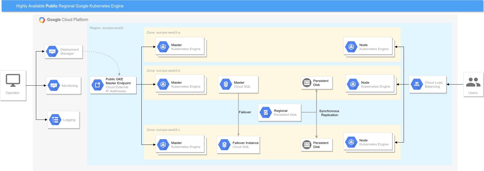

# GKE Deployment Manager Demo

Demo project to demonstrate GCP Deployment Manager automation tool capabilities for building GKE clusters and deploying example applications.

## Getting Started

These instructions will get you a fully functional GKE Regional Cluster including deployed example applications. See deployment for notes on how to deploy the cluster.

### Prerequisites

Google Cloud Platform Project.  
GCloud Command Line Tool.  
Google Cloud Platform Account with the following roles assigned:

* Compute.admin
* SQL.admin

## Secrets and additional settings

Provide secrets in `deploy-public.yaml` file.

* MySQL password for Drupal and Wordpress (`sql.properties.dbUser.password`, `drupal.properties.env.DB_PASSWORD`, `wp.properties.env.DB_PASSWORD`)
* GCP Service Account JSON Credentials (SQL Admin role assigned, base64 encoded) for CloudSQL Proxy Container - (`secret-service-account-drupal.properties.data` and `secret-service-account-wp.properties.data`)

Set pre-existing GKE Persistent Disk Name for Drupal Nginx static files - `pv-nginx.properties.pdName`.
Set Service Account Email Address - `sql.properties.cloudsql.serviceAccountEmailAddress`.

## Kubernetes and GCP Resources design


## Kubernetes Network Policies design


## Public Cluster

### Infrastructure Architecture



### Deployment

#### Deploy Dev example

```
$ gcloud deployment-manager deployments create example-dev --config deploy-public.yaml
```

#### Deploy Test example

```
$ gcloud deployment-manager deployments create example-test --config deploy-public.yaml
```

#### Deploy Prod example

```
$ gcloud deployment-manager deployments create example-prod --config deploy-public.yaml
```

## Private Cluster

TBD

### Infrastructure Architecture


### Deployment

TBD

## Authors

* **Piotr Kloskowski** - *Initial work* - [pklosk](https://github.com/pklosk)
